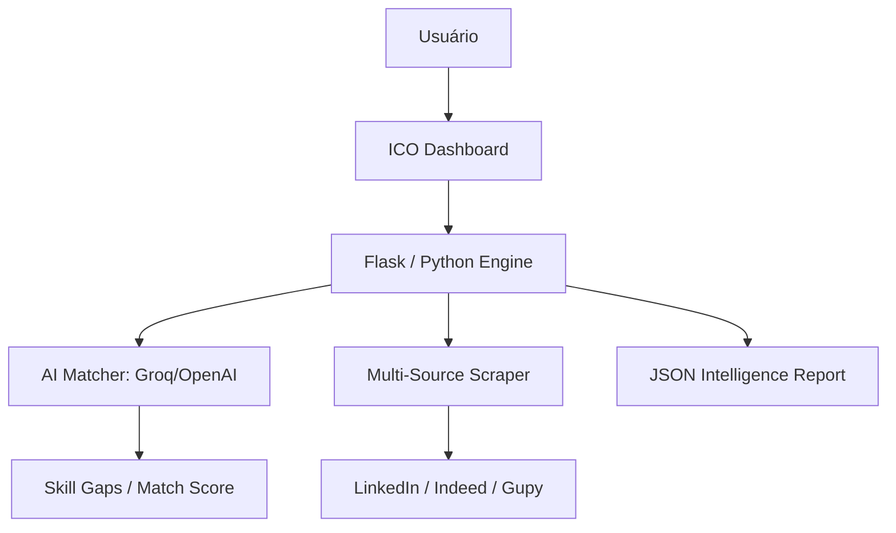

# CV autoenvio 🚀

> **A plataforma definitiva para otimização estratégica de carreira.**  
> _Pare de disparar currículos genéricos. Comece a ser contratado com precisão cirúrgica._

O **ICO (Intelligent Career Optimizer)** não é apenas um disparador de e-mails; é uma infraestrutura de IA projetada para elevar suas chances reais de contratação. Ele automatiza a busca, analisa a compatibilidade técnica e cultural, e oferece insights profundos para que você esteja sempre um passo à frente no recrutamento.

<p align="center">
  
</p>

---

## 🌟 Diferenciais Estratégicos

Diferente de bots de spam, o ICO foca em **valor real**:

- **Análise Profunda de Vagas**: Extrai senioridade, stack técnica, cultura e desafios reais de cada oportunidade.
- **AI Match Engine (Multi-Provider)**: Calcula um score de compatibilidade usando **GPT-4o** ou **Groq (Llama 3)**, identificando gaps de habilidades antes mesmo da entrevista.
- **Dashboard de Operações Real-time**: Interface premium para gerenciar buscas, ver logs de agentes em tempo real e acessar Technical Briefs.
- **Technical Brief & Interview Prep**: Gera automaticamente guias de estudo personalizados para cada vaga, incluindo possíveis perguntas técnicas e foco da entrevista.
- **Automação de Candidatura Humana**: Simula o comportamento humano para evitar detecção de bots em plataformas como LinkedIn e Indeed.

---

## 🏗️ Arquitetura do Sistema

O projeto é dividido em dois núcleos principais para máxima performance:

1.  **Core Backend (NestJS)**: Gerenciamento de usuários, persistência de dados em PostgreSQL, filas de processamento assíncrono com Redis/BullMQ.
2.  **Automation Engine (Python/Flask)**: Scrapers de alto nível, integração direta com LLMs (OpenAI/Groq) e Dashboard de agentes em tempo real.



---

## 🛠️ Stack Técnica

-   **Backend Core**: [NestJS](https://nestjs.com/) (Node.js) + TypeScript
-   **Automação & IA**: Python 3.13 + Flask
-   **Banco de Dados**: PostgreSQL com [Prisma ORM](https://www.prisma.io/)
-   **Inteligência Artificial**: OpenAI API & Groq Cloud (Llama 3.3)
-   **Filas & Cache**: Redis
-   **Interface**: HTML5 / CSS3 (Tailwind CSS) + Vanilla JS (SSE para logs)

---

## 🚀 Como Iniciar

### Pré-requisitos
- Node.js 18+ e Python 3.10+
- Docker (para Postgres e Redis)
- Chaves de API: OpenAI ou Groq

### Configuração da Automação (Dashboard)

1.  Acesse a pasta de automação:
    ```bash
    cd automation
    ```
2.  Configure o ambiente virtual e dependências:
    ```bash
    python3 -m venv venv
    source venv/bin/activate  # Linux/Mac
    pip install -r requirements.txt
    ```
3.  Configure o `.env` na raiz do projeto com suas credenciais.
4.  Inicie o Dashboard de IA:
    ```bash
    python app.py
    ```
5.  Acesse `http://localhost:5000` para começar a otimizar sua carreira.

---

## 📂 Estrutura do Projeto

-   `automation/`: Motor de IA e Dashboard de monitoramento.
-   `src/ai/`: Lógica de integração com modelos de linguagem.
-   `src/jobs/`: Pipeline de descoberta e análise de vagas.
-   `prisma/`: Schema e migrações do banco de dados.

---

Desenvolvido com foco em **Alta Performance** e **Posicionamento Profissional**. 
© 2026 ICO Team.

---

> **📊 Visualizações deste repositório**  
> O badge acima mostra o número de visualizações únicas deste README (atualizado automaticamente via [komarev.com](https://komarev.com/ghpvc)).  
> Obrigado pela visita! Se o projeto te inspirou, considere deixar uma estrela ⭐️.

**Padrão aplicado em todos os repositórios de Thomas Eduardo.**